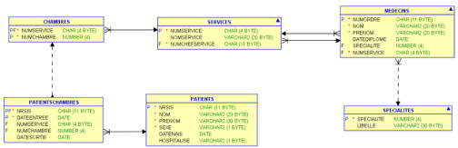

# Exercices sur le Langage de Définition des Données

Complétez le tableau des contraintes de la bd InfoSoft

<table>
<thead>
  <tr>
    <th>TABLES</th>
    <th colspan="4">CONTRAINTES D'INTÉGRITÉ</th>
  </tr>
</thead>
<tbody>
  <tr>
    <td></td>
    <td colspan="3">CONTRAINTES STRUCTURELLES</td>
    <td rowspan="2">CONTRAINTES APPLICATIVES</td>
  </tr>
  <tr>
    <td></td>
    <td>INTEGRITE<br>DEDOMAINES</td>
    <td>INTEGRITE<br>DERELATIONS</td>
    <td>INTEGRITE<br>DEREFERENCES</td>
  </tr>
  <tr>
    <td>EMPLOYES</td>
    <td></td>
    <td></td>
    <td></td>
    <td></td>
  </tr>
  <tr>
    <td>DÉPARTEMENTS</td>
    <td></td>
    <td></td>
    <td></td>
    <td></td>
  </tr>
  <tr>
    <td>PROJETS</td>
    <td></td>
    <td></td>
    <td></td>
    <td></td>
  </tr>
  <tr>
    <td>EMPPRO</td>
    <td></td>
    <td></td>
    <td></td>
    <td></td>
  </tr>
</tbody>
</table>


## LDD 1

Écrire et exécuter le script de création du schéma-HÔPITAL en respectant les points
suivants



```sql
PATIENTS(NrSis,Nom,Prenom,Sexe,DateNais,Hospitalise)
PATIENTSCHAMBRES(NrSis,DateEntree,NumService,NumChambre, DateSortie)
CHAMBRES(NumService,NumChambre)
SERVICES(NumService,NomService,NumChefService)
MEDECINS(NumOrdre,Nom,Prenom,DateDiplome,Specialite,NumService)
SPECIALITES(Specialite,libelle)
```

Les contraintes sont :

* Les clés primaires sont représentées dans le schéma relationnel ci-dessus (P).
* Les clés étrangères sont représentées dans le schéma relationnel ci-dessus (F).
* Les Nom, Prénom, sexe, chef de service et le numéro de service auquel le médecin est attaché doivent toujours être connus (*).
* Le sexe est égal à 'F', 'M' ou ‘X’, le champ hospitalisé à 'O' ou 'N' et par défaut 'N'.
* Les premiers caractères du NrSis sont la date de naissance du patient sous la forme YYMMDD
* Les premiers caractères du NumOrdre sont la date de diplôme du médecin sous la forme YYYYMM
* La date d’entrée à l’hôpital doit être inférieure à la date de sortie

Conventions de nommage des contraintes :

* Le nom des contraintes de clé primaire contiendra les lettres PK ainsi que le nom de la table concernée
* Le nom des contraintes de clé étrangère contiendront les lettres FK le nom de la table dans laquelle elles sont définies, le nom de la colonne concernée et le nom de la table référencée
* Le nom des contraintes applicatives contiendront les lettres CK le nom de la table dans laquelle elles sont définies et le nom de la colonne concernée
* Le nom des contraintes de type Not NULL contiendront les lettres NN le nom de la table dans laquelle elles sont définies et le nom de la colonne concernée

```sql


```

Écrire et exécuter les commandes pour insérer un minimum de trois lignes dans chaque table du schéma "Hopital".
L'ordre des INSERT est-il important ? Pourquoi ?

```sql

```

## LDD3

Écrire et exécuter les commandes pour modifier un numéro d'ordre d'un médecin-chef de service..

```sql

```

## LDD 4

Écrire et exécuter les commandes pour supprimer tout ce qui concerne un patient hospitalisé.

```sql

```

## LDD 5

Écrire et exécuter les commandes pour supprimer un médecin-chef de service.
À vous de choisir une option pour conserver la base dans un état cohérent.

```sql

```

## LDD 6

Écrire et exécuter les commandes pour effacer toutes les tables du schéma "Hopital", sans utiliser l'option CASCADE CONSTRAINT.

```sql

```

### LDD 7

Modifier le script de la question LDD 1 avec les points suivants :

* Le numéro de service auquel est attaché un médecin devient une contrainte différée
* L'option de `ON DELETE CASCADE` est spécifiée sur la colonne `NrSis` de la table `PatientsChambres`.

Exécuter ce nouveau script et insérer les données dans les tables en tenant compte des modifications réalisées.

Expliquer et montrer l'utilité de l'option `ON DELETE CASCADE`

> 

```sql

````

> 

```sql

```

## LDD 8

Ecrire et exécuter les commandes pour effacer toutes les tables du schéma `Hopital` en utilisant l'option `CASCADE CONSTRAINTS`.

```sql


```
